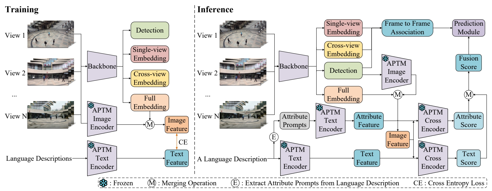

# Cross-view Referring Multi-Object Tracking（CRMOT）

> [**【AAAI 2025】Cross-View Referring Multi-Object Tracking**](https://arxiv.org/abs/2412.17807)            
> Sijia Chen, En Yu, Wenbing Tao  
> *[ArXiv] Paper ([https://arxiv.org/abs/2412.17807](https://arxiv.org/abs/2412.17807))*

If you have any problems with our work, please issue me. We will promptly reply it.

Thanks for your attention! If you are interested in our work, please give us a star ⭐️.

## Introduction


**Abstract:** Referring Multi-Object Tracking (RMOT) is an important topic in the current tracking field. Its task form is to guide the tracker to track objects that match the language description. Current research mainly focuses on referring multi-object tracking under single-view, which refers to a view sequence or multiple unrelated view sequences. However, in the single-view, some appearances of objects are easily invisible, resulting in incorrect matching of objects with the language description. In this work, we propose a new task, called Cross-view Referring Multi-Object Tracking (CRMOT). It introduces the cross-view to obtain the appearances of objects from multiple views, avoiding the problem of the invisible appearances of objects in RMOT task. CRMOT is a more challenging task of accurately tracking the objects that match the language description and maintaining the identity consistency of objects in each cross-view. To advance CRMOT task, we construct a cross-view referring multi-object tracking benchmark based on CAMPUS and DIVOTrack datasets, named CRTrack. Specifically, it provides 13 different scenes and 221 language descriptions. Furthermore, we propose an end-to-end cross-view referring multi-object tracking method, named CRTracker. Extensive experiments on the CRTrack benchmark verify the effectiveness of our method.





## News
* (2024.12.23) Our dataset and code are opened!
* (2024.12.10) Our paper is accepted by AAAI 2025!


## Environment Configuration for CRTracker

* Note: We use a NVIDIA GeForce RTX 3090 GPU and cuda 11.1. 

* Clone this repo

* Create and enter a virtual environment. We use python 3.8.
```
conda create -n CRTracker python=3.8
conda activate CRTracker
```

* Install pytorch. We use pytorch == 1.7.1.
```
conda install pytorch==1.7.1 torchvision==0.8.2 torchaudio==0.7.2 cudatoolkit=11.0 -c pytorch
```

* Go to the CRTracker folder. Install some packages.
```
cd ${CRTracker}
pip install -r requirements.txt -i https://pypi.tuna.tsinghua.edu.cn/simple/
```

* Install the corresponding version of DCNv2.
```
git clone -b pytorch_1.7 https://github.com/ifzhang/DCNv2.git
cd DCNv2
bash ./make.sh
```

* Install the video synthesis package.
```
conda install ffmpeg
pip install ffmpy -i https://pypi.tuna.tsinghua.edu.cn/simple/
```

* Install numpy before version 1.24.
```
pip uninstall numpy
pip install numpy==1.23.5 -i https://pypi.tuna.tsinghua.edu.cn/simple/
```

## Dataset Preparation

* You need download our CRTrack dataset. The CRTrack dataset can be downloaded from this link [[Baidu],code:hust](https://pan.baidu.com/s/1jSxEl_-bdBl8uf50bh1dNw?pwd=hust).

The After downloading, you should prepare the data in the following structure:
```
CRMOT
  |
  |
  |————CRMOT_evaluation
  |
  |
  |————CRTracker
  |
  |
  └————datasets
        |
        |
        └————CRTrack
                |——————CRTrack_Cross-domain
                |        |——————images
                |        |        └——————test
                |        |                |——————Garden1_View1
                |        |                |——————Garden1_View2
                |        |                |——————Garden1_View3
                |        |                |——————Garden1_View4
                |        |                └——————Garden2_View1....
                |        └——————labels_with_ids_text
                |                 └——————test
                |                         |——————gt_test
                |                         |——————gt_train
                |                         |——————results(empty)
                |                         └——————trackled_text
                └——————CRTrack_In-domain
                         |——————images
                         |        |——————train
                         |        |       |——————Floor_View1
                         |        |       |——————Floor_View2
                         |        |       |——————Floor_View3
                         |        |       └——————Gate1_View1....
                         |        └——————test
                         |                |——————Circle_View1
                         |                |——————Circle_View2
                         |                |——————Circle_View3
                         |                └——————Gate2_View1....
                         |——————labels_with_ids
                         |        └——————train
                         |——————labels_with_ids_cross_view
                         |        └——————train
                         └——————labels_with_ids_text
                                  |——————train
                                  |       |——————gt_test
                                  |       |——————gt_train
                                  |       |——————results(empty)
                                  |       └——————trackled_text
                                  └——————test
                                          |——————gt_test
                                          |——————gt_train
                                          |——————results(empty)
                                          └——————trackled_text
```

* Run the src/dataset_util/gen_labels_dataset.py code to generate the datasets/CRTrack/CRTrack_In-domain/labels_with_ids folder and the files it contains.

Note: Each time before running the gen_labels_dataset.py file, you need to delete the previously generated labels_with_ids folder.

* Run the src/dataset_util/convert_cross_view.py code to generate the datasets/CRTrack/CRTrack_In-domain/labels_with_ids_cross_view folder and the files it contains.

Note: Each time before running the convert_cross_view.py file, you need to delete the previous labels_with_ids_cross_view folder.

* Modify the path (lines 5-8 of set_CRTracker_train.py) in the src/dataset_util/set_CRTracker_train.py file. Create a new data folder under the src folder, and then run the src/dataset_util/set_CRTracker_train.py file.

Note: 1. Before running the set_CRTracker_train.py file each time, you need to delete the previously generated src/data/CRTrack_In-domain.train file. 2. Make sure that the folder pointed to by label in line 7 of set_CRTracker_train.py only contains the folder of the training set, and no other files such as compressed files.

* Generate language tags gt

CRTrack In-domain:
```
python src/dataset_util/gen_In-domain_gt_train.py
python src/dataset_util/gen_In-domain_gt_test.py
```

CRTrack Cross-domain:
```
python src/dataset_util/gen_Cross-domain_gt_test.py
```

* Change the absolute path of the CRTrack dataset to the root path in the src/lib/cfg/CRTrack_In-domain.json file. Change the absolute path of the CRTrack dataset to the data_dir path in the src/lib/opts.py file.

## Training

* You need download APTM model and pre-trained model. The APTM model and pre-trained model can be downloaded from this link [[Baidu],code:hust](https://pan.baidu.com/s/1eLXFa3ZPQuJnDeIuTVBoKg?pwd=hust).


The After downloading, you should prepare the data in the following structure:
```
CRMOT
  |
  |
  |————CRMOT_evaluation
  |
  |
  |————datasets
  |
  |
  └————CRTracker
          |
          |
          └————model
                 |——————APTM_models
                 |——————CrossMOT_models
                 └——————FairMOT_models
```

* Set the set path in line 25 of the src/train.py file to the absolute path of your own src folder.

Then run:
```
bash experiments/train.sh
```

* You can download our trained model of CRTracker. our trained model of CRTracker can be downloaded from this link [[Baidu],code:hust](https://pan.baidu.com/s/1mNs_DVQ88Z5fAyAcnHcnng?pwd=hust).

The After downloading, you should prepare the data in the following structure:
```
CRMOT
  |
  |
  |————CRMOT_evaluation
  |
  |
  |————datasets
  |
  |
  └————CRTracker
          |
          |
          └————our_trained_models
                    |
                    |
                    └————CRTracker_model_20.pth
```

## Inference
run:
```
bash experiments/test.sh
```

## Evaluation

### Environment Configuration for Evaluation

Note: We conducted the evaluation on the Windows system.

* Install MATLAB 2020a

* Create and enter a virtual environment
```
conda create -n CRMOT_evaluation python=3.7
conda activate CRMOT_evaluation
```

* Go to the CRMOT_evaluation\MOT folder

then run:
```
pip install -r requirements.txt
pip install openpyxl
```

* Install the matlab.engine library. 

Open the terminal and switch to the extern\engines\python folder in the Matlab installation folder on your computer.

then run:
```
python setup.py install
```

### Process for Evaluation

* After the inference is completed, compress the inference result folder, then download the compressed package to the CRMOT_evaluation\data\In-domain\Inference_results or CRMOT_evaluation\data\Cross-domain\Inference_results folder and decompress it.

* Modify the path in inference_convert.py. 

To rename the inference result file, run:
```
python inference_convert.py
```

* Modify the path in gt_convert.py.

To process GT folders, sort and rename, run:
```
python gt_convert.py
```

* Integrate inference results and ground truth labels.
```
python cv_test\prepare_cross_view_eval.py
```

* Evaluate
```
python MOT\evalMOT.py
```

* Statistics CVRIDF1 and CVRMA metrics

Go to the CRMOT_evaluation\data\In-domain\eval\eval_results folder or the CRMOT_evaluation\data\Cross-domain\eval\eval_results folder to collect statistical indicators.

Note:

CVRMA metric：MOTA in XXX_CVRMA.xlsx is CVRMA.

CVRIDF1 metric：IDF1 in XXX_CVRIDF1.xlsx is CVRIDF1.

## Acknowledgement
The part of the code are borrowed from the follow work:
- [shengyuhao/DIVOTrack](https://github.com/shengyuhao/DIVOTrack)
- [ifzhang/FairMOT](https://github.com/ifzhang/FairMOT)
- [wudongming97/RMOT](https://github.com/wudongming97/RMOT)

Thanks for their wonderful works.

## Citation
```
@article{chen2024cross,
  title={Cross-View Referring Multi-Object Tracking},
  author={Chen, Sijia and Yu, En and Tao, Wenbing},
  journal={arXiv preprint arXiv:2412.17807},
  year={2024}
}
```
